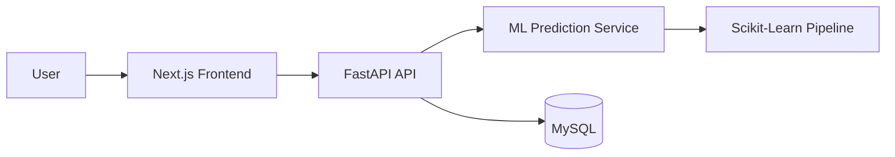

# Predicting Student Dropout in Higher Education

A graduation project monorepo for predicting student dropout risk using:

- Next.js + TypeScript frontend
- Tailwind CSS for styling
- FastAPI backend
- Scikit-Learn + Pandas ML pipeline
- MySQL for persistence

## Project Structure

```text
student-dropout-prediction/
  frontend/
  backend/
  docker-compose.yml
  .env.example
  README.md
```

## Frontend Roles

- `/teacher` -> teacher dashboard folder and page
- `/administrator` -> administrator dashboard folder and page
- `/` -> role selection landing page

## Architecture



## Backend

The backend exposes endpoints for health checks, single-student dropout prediction, and batch risk scoring.

## Frontend

The frontend provides an admin-style dashboard with risk metrics, trend charts, and student lists.

## Local Setup

1. Copy `.env.example` to `.env` and adjust credentials.
2. Start MySQL with Docker Compose.
3. Install dependencies in `backend/` and `frontend/`.
4. Run the backend and frontend dev servers.

## Next Steps

- Replace the baseline ML heuristic with a trained pipeline from a real dataset.
- Add authentication and role-based access control.
- Connect prediction history and student records to MySQL.
- Extend analytics with model evaluation metrics and feature importance.
