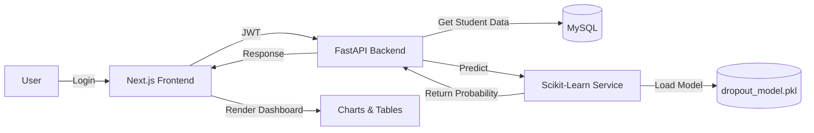

# 🚀 Nidaamka Saadaalinta Ardayda Ka Haraysa Jaamacadda (DropoutSyS Student Dropout Prediction System)

**Ujeeddo:**

Nidaamkan waxa uu ka caawiyaa jaamacadaha in ay saadaaliyaan ardayda halista ugu jirta inay ka baxaan waxbarashada, iyada oo la adeegsanayo xogta akadeemiga, dhaqan-dhaqaale, iyo algorithm‑ka Mashiinka Barashada (*ML*).  Nidaamku wuxuu ka kooban yahay *backend* FastAPI, *frontend* Next.js, iyo adeegga saadaalinta ee Scikit‑Learn.

---

## 📁 1. Qaabdhismeedka Galalka Mashruuca

```
student-dropout-prediction/
│
├── backend/                     # koodhka Python (FastAPI)
│   ├── app/
│   │   ├── api/                # Endpoints (auth, student, predict)
│   │   ├── db/                 # Session, migrations, seeds
│   │   ├── models/             # SQLAlchemy ORM models
│   │   ├── schemas/            # Pydantic validation
│   │   └── utils/              # Security, helpers
│   ├── migrate.py               # Alembic migration runner
│   └── main.py                  # FastAPI entry‑point
│
├── frontend/                    # koodhka React/Next.js
│   ├── src/
│   │   ├── app/
│   │   │   ├── administrator/_components/   # Dashboard admin
│   │   │   └── teacher/_components/        # Dashboard macallin
│   │   └── pages/               # Next.js pages (login, dashboard…)
│   └── package.json
│
├── ml_core/                     # Mashiinka ML
│   ├── train_model.py            # Tababarka model-ka
│   ├── predict_logic.py          # Xisaabinta probability‑ga dropout
│   └── saved_models/dropout_model.pkl   # Model‑ka la keydiyay
│
├── requirements.txt             # Python dependencies
├── README.md                     # Halkan waxa aad hadda akhrineysaa
└── .env.example                  # Tusaale env variables
```

---

## 🔧 2. Sharaxaadda Qaybaha Muhiimka ah

### Backend (FastAPI)
- **`main.py`** – Abuuridda `FastAPI` app, diiwaangelinta router‑yada, iyo *CORS*.
- **`api/auth.py`** – Login‑ka JWT, abuurista token‑ka, iyo *dependency* `get_current_user`.
- **`api/student_routes.py`** – CRUD‑ka ardayda, soo dejinta CSV‑ga, iyo faahfaahin arday.
- **`api/predict_routes.py`** – Endpoint `/predict` oo wacaya `ml_core/predict_logic.py` si loo helo *dropout probability*.
- **`models/`** – *SQLAlchemy* models: `Student`, `Class`, `Attendance`, `Grades`, `Prediction`, iyo sidoo kale `User` (admin, dean, macallin).
- **`schemas/`** – *Pydantic* schema‑yada xaqiijinta xogta soo galeysa (login, student, prediction).
- **`utils/security.py`** – *Password hashing* (bcrypt) iyo *JWT* utilities.
- **`db/`** – `session.py` (engine & Session), `run_migrations.py` (Alembic), iyo `seed.py` (tusmo xog tijaabo).

### Frontend (Next.js)
- **Pages** – `login.tsx`, `dashboard.tsx`, `admin.tsx`, `teacher.tsx`.
- **Components** – Kaararka ardayda, shaxda *risk level*, *charts* (Chart.js ama Recharts).
- **API client** – `utils/api.ts` oo adeegsada `fetch` si uu ula xiriiro backend‑ka (`/api/...`).
- **Authentication** – Token‑ka JWT waxa lagu kaydiyaa `localStorage` oo lagu diraa *Authorization* header.

### ML Core (Scikit‑Learn)
- **`train_model.py`** – Akhriyaa `train.csv`, nadiifiyaa xogta, abuurtaa *pipeline* (imputer + StandardScaler + RandomForest), tababaraa model‑ka, oo kaydiya `dropout_model.pkl`.
- **`predict_logic.py`** – **Load** model‑ka, qaataa *payload* JSON ee arday, sameeyaa *pre‑processing* (isku mid ahaanshaha pipeline), una soo celinayaa:
  ```json
  {"probability": 0.73, "risk_level": "High"}
  ```
- **Model** – RandomForest oo leh *feature importance* (attendance, GPA, financial strain, etc.).

---

## 🔄 3. Socodka Xogta (Data Flow)



1. **User** waxay gashaa *login* → helaa JWT.
2. **Frontend** codsiga API‑yada oo wata token‑ka.
3. **Backend** hubiyaa token‑ka, ka soo qaadaa MySQL xogta ardayga.
4. **Backend** wacaa `predict_logic` → **ML Service** xisaabisaa *dropout probability*.
5. Natiijada ayaa lagu soo celinayaa frontend, oo muujinaysa *risk level* iyo *chart*-yada.

---

## ⚙️ 4. Deegaanka Horumarinta (Local Setup)
1. **Clone** repo → `git clone https://...`
2. **Backend**:
   ```bash
   cd backend
   python -m venv venv
   source venv/Scripts/activate   # Windows
   pip install -r ../requirements.txt
   alembic upgrade head           # migrations
   uvicorn main:app --reload
   ```
3. **Frontend**:
   ```bash
   cd ../frontend
   npm install
   npm run dev   # runs on http://localhost:3000
   ```
4. **ML** (ikhtiyaari):
   ```bash
   cd ../ml_core
   python train_model.py   # creates dropout_model.pkl
   ```
5. **Database** – MySQL sida `docker-compose.yml` ama local installation; *env* file ka buuxi `MYSQL_USER`, `MYSQL_PASSWORD`, `MYSQL_DB`.

---

## 📈 5. Tallaabooyinka Xiga (Next Steps)
- **Model**: Ku dar xog dhab ah oo jaamacadda ka soo ururiso, dib‑u‑tababar RandomForest ama *XGBoost*.
- **Authentication**: Ku dar *role‑based* permissions (Admin, Dean, Teacher).
- **Persist Predictions**: Keydi natiijooyinka iyo taariikhda prediction‑ka MySQL si loo sameeyo *historical analytics*.
- **Dashboard Enhancements**: Ku dar *feature importance* visualisation, *trend* graphs, iyo *export* CSV/Excel.
- **Testing**: Qor *unit* iyo *integration* tests (pytest + httpx) ee API‑yada.
- **Deployment**: Dockerise FastAPI iyo Next.js, ku shubo *cloud* (GCP/AWS) iyadoo la isticmaalayo *CI/CD* pipelines.

---

**🤝 Waxaa la talinayaa** in qofka horumariya uu akhriyo qaybaha `README.md`, `backend/app/api/`, iyo `ml_core/` si uu si buuxda ugu fahmo nidaamka, ka dibna uu bilaabo in uu ku daro horumarin lagu soo jeediyay *Next Steps*.
