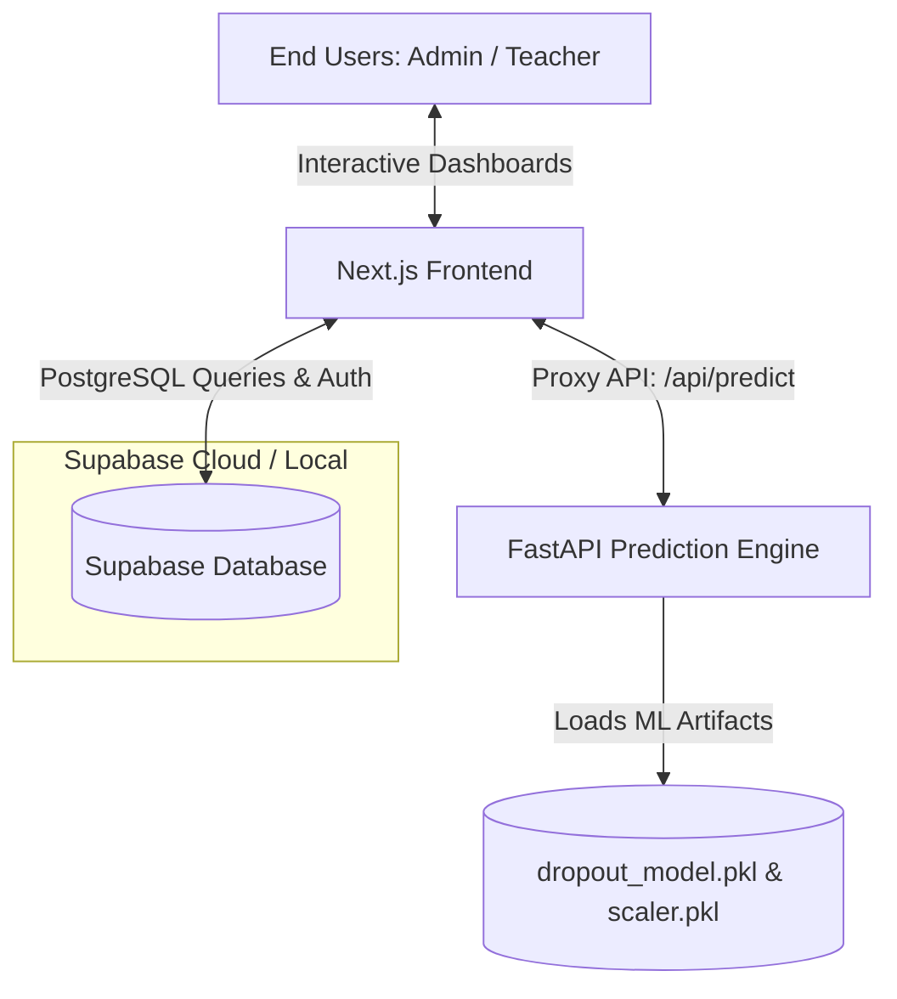
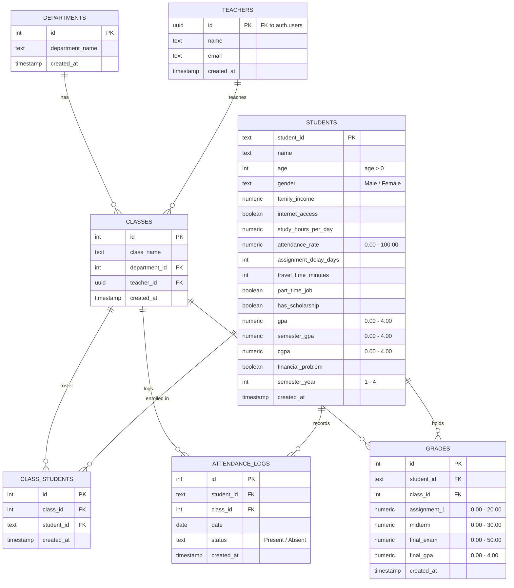

# 🎓 Student Dropout Prediction System (DropoutSyS)
## App & Database System Summary

This document provides a comprehensive technical summary of the **Student Dropout Prediction System (DropoutSyS)**. It outlines the application architecture, frontend interfaces, backend ML services, database schema design, Row Level Security (RLS) configuration, and automatic database triggers.

---

## 💻 1. System Architecture Overview

The system is designed with a modern decoupled architecture consisting of three core parts:



### A. Next.js Frontend
* **Core Technology:** Next.js (App Router), TypeScript, Vanilla CSS/Tailwind, Recharts.
* **Dual Execution Mode:**
  * **Live Mode:** Connects to Supabase Database and queries records in real time.
  * **Mock Mode (Offline Fallback):** Activates automatically when Supabase credentials are missing or set to placeholder values, using a mock state machine to allow offline testing and development.
* **Role-Based Interfaces:**
  * **Administrator Portal:** High-level overview, CRUD operations on departments, teachers, classes, and students, CSV data import, and system diagnostics.
  * **Teacher Portal:** Class roster views, attendance logs entry, grade management, and individual student risk assessments.

### B. FastAPI Backend (Prediction Engine)
* **Core Technology:** FastAPI, Scikit-learn, Pandas, Joblib.
* **Machine Learning Model:**
  * Loads a trained **Random Forest Classifier** (`dropout_model.pkl`), a **Standard Scaler** (`scaler.pkl`), and label encoding mappings.
  * Inputs 16 student demographic, financial, and academic features to calculate a numerical **dropout probability** (0.00 to 1.00).
  * Classifies students into **3 Risk Tiers**:
    * **Low Risk (Safe - Green):** Probability < 0.30.
    * **Medium Risk (At Risk - Yellow):** Probability 0.30 - 0.49.
    * **High Risk (High Risk - Red):** Probability $\ge$ 0.50.
  * **Fallback Prediction:** If the Python ML backend is offline, the Next.js API route (`/api/predict`) falls back to a deterministic mathematical warning calculation based on GPAs, attendance, assignment delays, and financial strain.

---

## 🗄️ 2. Database Schema (`dropout` Custom Schema)

The database runs on PostgreSQL (hosted via Supabase) and is partitioned inside a dedicated `dropout` schema. Below is a detailed view of the tables, their relationships, and constraints.



### Table Details & Attributes

#### 1. `dropout.departments`
Stores academic department listings.
* `id` (SERIAL PRIMARY KEY)
* `department_name` (TEXT, NOT NULL)
* `created_at` (TIMESTAMP WITH TIME ZONE, DEFAULT: `now()`)

#### 2. `dropout.teachers`
Stores faculty profiles. Linked directly to Supabase Authentication users.
* `id` (UUID PRIMARY KEY, REFERENCES `auth.users(id)` ON DELETE CASCADE)
* `name` (TEXT, NOT NULL)
* `email` (TEXT, UNIQUE, NOT NULL)
* `created_at` (TIMESTAMP WITH TIME ZONE, DEFAULT: `now()`)

#### 2.5. `dropout.administrators`
Stores administrator profiles. Linked directly to Supabase Authentication users.
* `id` (UUID PRIMARY KEY, REFERENCES `auth.users(id)` ON DELETE CASCADE)
* `name` (TEXT, NOT NULL)
* `email` (TEXT, UNIQUE, NOT NULL)
* `created_at` (TIMESTAMP WITH TIME ZONE, DEFAULT: `now()`)

#### 3. `dropout.classes`
Stores individual classrooms or courses.
* `id` (SERIAL PRIMARY KEY)
* `class_name` (TEXT, NOT NULL)
* `department_id` (INTEGER, REFERENCES `dropout.departments(id)` ON DELETE CASCADE)
* `teacher_id` (UUID, REFERENCES `dropout.teachers(id)` ON DELETE SET NULL)
* `created_at` (TIMESTAMP WITH TIME ZONE, DEFAULT: `now()`)

#### 4. `dropout.students`
Stores comprehensive academic, demographic, and behavioral metrics utilized as features by the ML model.
* `student_id` (TEXT PRIMARY KEY) - e.g., University Student ID card number
* `name` (TEXT, NOT NULL)
* `age` (INTEGER, NOT NULL) - Check: `age > 0`
* `gender` (TEXT, NOT NULL) - Check: `gender IN ('Male', 'Female')`
* `family_income` (NUMERIC(10,2), NOT NULL)
* `internet_access` (BOOLEAN, DEFAULT: `TRUE`)
* `study_hours_per_day` (NUMERIC(4,1), DEFAULT: `2.0`, Check: `study_hours_per_day >= 0.0`)
* `attendance_rate` (NUMERIC(5,2), DEFAULT: `100.00`, Check: `between 0.00 and 100.00`) - *Automatically calculated by trigger*
* `assignment_delay_days` (INTEGER, DEFAULT: `0`)
* `travel_time_minutes` (INTEGER, DEFAULT: `0`)
* `part_time_job` (BOOLEAN, DEFAULT: `FALSE`)
* `has_scholarship` (BOOLEAN, DEFAULT: `FALSE`)
* `gpa` (NUMERIC(3,2), DEFAULT: `4.00`, Check: `between 0.00 and 4.00`) - *Automatically calculated by trigger*
* `semester_gpa` (NUMERIC(3,2), DEFAULT: `4.00`, Check: `between 0.00 and 4.00`)
* `cgpa` (NUMERIC(3,2), DEFAULT: `4.00`, Check: `between 0.00 and 4.00`)
* `financial_problem` (BOOLEAN, DEFAULT: `FALSE`)
* `semester_year` (INTEGER, NOT NULL) - Check: `between 1 and 4`
* `created_at` (TIMESTAMP WITH TIME ZONE, DEFAULT: `now()`)

#### 5. `dropout.class_students` (Junction Table)
Maps students to classes, establishing the roster link.
* `id` (SERIAL PRIMARY KEY)
* `class_id` (INTEGER, REFERENCES `dropout.classes(id)` ON DELETE CASCADE)
* `student_id` (TEXT, REFERENCES `dropout.students(student_id)` ON DELETE CASCADE)
* `created_at` (TIMESTAMP WITH TIME ZONE, DEFAULT: `now()`)
* **Constraints:** `UNIQUE (class_id, student_id)`

#### 6. `dropout.attendance_logs`
Logs daily attendance records.
* `id` (SERIAL PRIMARY KEY)
* `student_id` (TEXT, REFERENCES `dropout.students(student_id)` ON DELETE CASCADE)
* `class_id` (INTEGER, REFERENCES `dropout.classes(id)` ON DELETE CASCADE)
* `date` (DATE, NOT NULL)
* `status` (TEXT, NOT NULL) - Check: `status IN ('Present', 'Absent')`
* `created_at` (TIMESTAMP WITH TIME ZONE, DEFAULT: `now()`)
* **Constraints:** `UNIQUE (student_id, class_id, date)`

#### 7. `dropout.grades`
Tracks assignment, midterm, final, and cumulative GPA records for specific classes.
* `id` (SERIAL PRIMARY KEY)
* `student_id` (TEXT, REFERENCES `dropout.students(student_id)` ON DELETE CASCADE)
* `class_id` (INTEGER, REFERENCES `dropout.classes(id)` ON DELETE CASCADE)
* `assignment_1` (NUMERIC(4,2), DEFAULT: `0.00`, Check: `between 0.00 and 20.00`)
* `midterm` (NUMERIC(4,2), DEFAULT: `0.00`, Check: `between 0.00 and 30.00`)
* `final_exam` (NUMERIC(5,2), DEFAULT: `0.00`, Check: `between 0.00 and 50.00`)
* `final_gpa` (NUMERIC(3,2), DEFAULT: `4.00`, Check: `between 0.00 and 4.00`)
* `created_at` (TIMESTAMP WITH TIME ZONE, DEFAULT: `now()`)
* **Constraints:** `UNIQUE (student_id, class_id)`

---

## ⚡ 3. Automated Database Triggers

To maintain strict synchronization between raw operational logs and the high-level student feature states used by the Machine Learning model, the system uses two active PostgreSQL database triggers:

### A. Dynamic Attendance Rate Trigger
Whenever an entry in `dropout.attendance_logs` is **inserted, updated, or deleted**, the system executes `dropout.update_student_attendance_rate()`.
* **Formula:** $\text{Attendance Rate} = \frac{\text{Present Days}}{\text{Total Days Logged}} \times 100.00$
* **Fallback:** If no days are logged, defaults to `100.00`.
* **Action:** Updates `attendance_rate` inside the `dropout.students` table for the matching `student_id`.

### B. Dynamic GPA Trigger
Whenever an entry in `dropout.grades` is **inserted, updated, or deleted**, the system executes `dropout.update_student_gpa()`.
* **Formula:** $\text{GPA} = \text{Average}(\text{final\_gpa})$ across all classes for that student.
* **Action:** Updates `gpa` inside the `dropout.students` table for the matching `student_id`.

---

## 🔐 4. Row Level Security (RLS) Policies

To protect sensitive student information and comply with privacy rules, RLS is enabled on all tables in the `dropout` schema.

### Role Check Function: `dropout.is_admin()`
Evaluates whether the authenticated user is an Administrator:
```sql
CREATE OR REPLACE FUNCTION dropout.is_admin()
RETURNS BOOLEAN AS $$
BEGIN
  RETURN EXISTS (SELECT 1 FROM dropout.administrators WHERE id = auth.uid());
END;
$$ LANGUAGE plpgsql SECURITY DEFINER;
```

### Table Access Rules Matrix

| Table Name | Administrator Permission | Teacher Permission |
| :--- | :--- | :--- |
| `departments` | **Full Access** (CRUD) | **Read-Only** (SELECT) |
| `teachers` | **Full Access** (CRUD) | **Read-Only** (Own record `auth.uid() = id`) |
| `administrators` | **Full Access** (CRUD) | **No Access** |
| `classes` | **Full Access** (CRUD) | **Read-Only** (Assigned classes `teacher_id = auth.uid()`) |
| `students` | **Full Access** (CRUD) | **Read-Only** (Students in their classes) |
| `class_students` | **Full Access** (CRUD) | **Read-Only** (Class rosters for their classes) |
| `attendance_logs`| **Full Access** (CRUD) | **Full Access** for their assigned classes only |
| `grades` | **Full Access** (CRUD) | **Full Access** for their assigned classes only |

---

## 📈 5. Machine Learning Features & Preprocessing Pipeline

The FastAPI prediction model expects a aligned and scaled feature vector. The server aligns and transforms incoming JSON data:

1. **Boolean Mapping:** Convert boolean variables (like `internet_access`, `part_time_job`, etc.) to binary integers (`0` or `1`).
2. **Gender Mapping:** Statically map `Male` to `1` and `Female` to `0`.
3. **Interaction Terms:** Compute:
   * $\text{GPA Attendance Interaction} = \text{GPA} \times \text{Attendance Rate}$
   * $\text{CGPA Attendance Interaction} = \text{CGPA} \times \text{Attendance Rate}$
4. **One-Hot Encoding:** Dynamically pad missing categorical categories (e.g. other semesters or departments) with `0`.
5. **Standard Scaling:** Apply the pre-trained `StandardScaler` transformations to continuous numerical metrics.
6. **Inference:** Run the Random Forest classifier prediction to calculate the dropout probability returned to the frontend.
